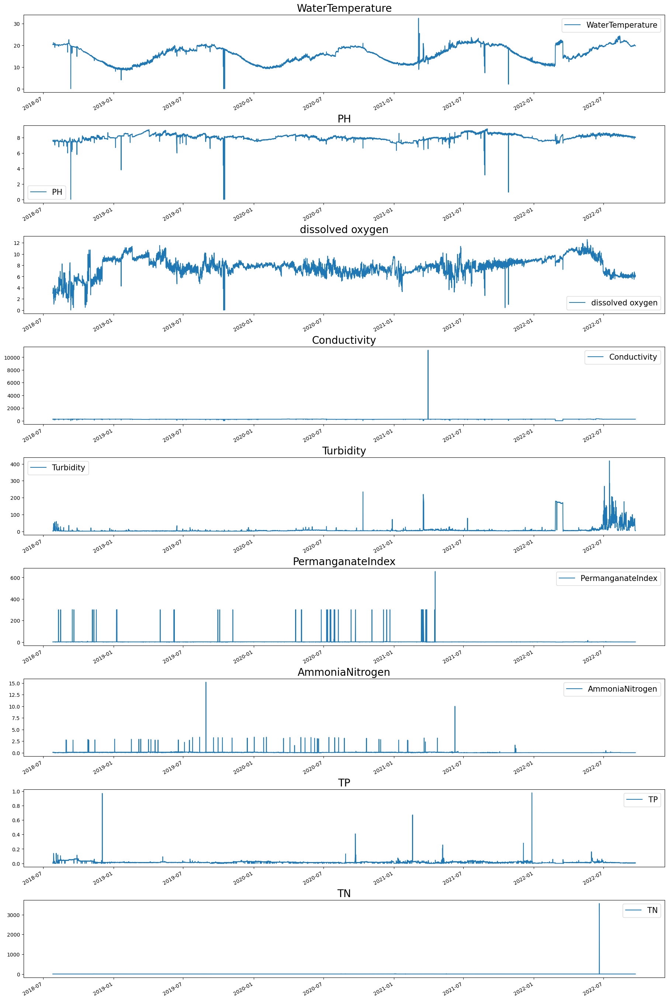
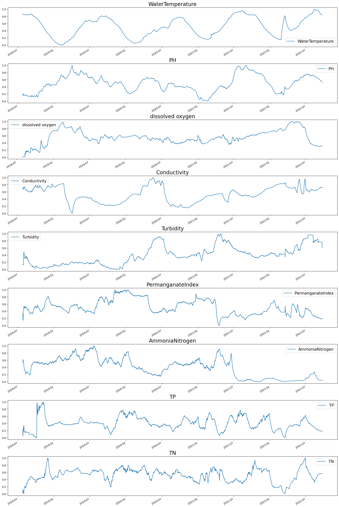

# How predict the index of water quality by networks

## Clean and scale data

### 1. Read and transform data

First we import some modules

```[python]
import pandas as pd
import numpy as np
import matplotlib.pyplot as plt
```

Read in the excel data.

```[python]
# data.xls is the name of excel file
# heder = 2, use the second row as dataframe header.
# uscols = keys, keys is a list contained by the names of indicators 
# we interesting in.
df = pd.read_excel('data.xls', header=2, usecols=keys)

# The original data is arranged in reverse chronological order.
# Here we revers it.
df = df.loc[::-1].reset_index(drop=True)

# Drop the useless data
df.drop(range(178), inplace=True)

# Convert the time column to pd.Datatime class
df[df.columns[0]] = pd.to_datetime(arg=df[df.keys()[0]], format='%Y-%m-%d %H:%M:%S')

# Set the time column as the index column of our dataframe
df.set_index(df.columns[0], inplace=True)

# Convert all '--' to None.
df.replace(to_replace= '--', value = None, inplace=True)

# Change all datatype as float
df = df.astype('float64')

# Use the preknowledge the value of data should bigger than zero.
df = df.abs()
```

### 2. Data Clean

For example,in the water quality index of WangFei island,there are fiftten indicators(采集时间, 接收时间, 采集方式, 水温, pH, 溶解氧, 电导率, 浊度, 高锰酸盐指数, 氨氮, 总磷, 总氮, 湿度, 室温, 叶绿素, 藻密度).However, we do not care about all the fifteen indicators and some indicators have too little data to use.The first thing we need to do is select some indicators we care about most.Here we choose [采集时间, 水温, pH, 溶解氧, 电导率, 浊度, 高锰酸盐指数, 氨氮, 总磷, 总氮],total nine indicators except the time index.

* 采集时间: Acquisition time.
* 水温: Water temperture.
* 电导率: Conductivity
* 浊度: Turbidity.
* 高锰酸盐指数: Permanganate index.
* 氨氮: Ammonia nitrogen.
* 总磷: Total phosphorus(TP).
* 总氮: Total nitrogen(TN).

After checking the numbers in data,we could find there are many outliers between those numbers.We can see it more clearly by image.



First we want to remove the numbers which are wrong.For example,the numbers of conductivity should be range from 50 to 500 uS/cm,as the data comes from a river.We show the common range of the nine index below this sentence.If the value of an indicator is outside the reasonable range,we should remove it(labling as 'None').We called this method 'cutoff'.However,cutoff method need preknowledge about the water quality and a assumption that the value will not change out of the range.This assumption will potentially eliminate the authenticity of the data.We recommand to use this method when we know the wrong number(99999.99) of the measuring instrument.

The other methods come from statistics.We use Zscore,Standard Deviation and modify zscore mthods [Outlier Methods](https://towardsdatascience.com/outlier-detection-part1-821d714524c#:~:text=For%20example%2C%20a%20z%2Dscore,similar%20to%20standard%20deviation%20method.) to elimate errors in the data.

```[python]
# All the outliers detect methods we may used.
# They all return a Bool type dataframe.The True value in returns
# indicating the this value of the particular label is a outlier
# should be None.
def zscore(df, k, threshold=1.5):
    all_value = df[k].values.copy()
    indices = np.array(list(map(lambda x: not x, np.isnan(all_value))))
    true_value = all_value[indices]
    m = np.mean(true_value)
    s = np.std(true_value)
    
    all_value[indices] = np.abs((all_value[indices] - m) / s)
    all_value = pd.Series(all_value)
    return all_value > threshold

def modify_zscore(df, k, threshold=2):
    all_value = df[k].values.copy()
    indices = np.array(list(map(lambda x: not x, np.isnan(all_value))))
    true_value = all_value[indices]
    m = np.mean(true_value)
    diff = all_value[indices] - m
    median = np.median(np.abs(diff))
    
    all_value[indices] = np.abs(0.6745 * (diff) / median)
    all_value = pd.Series(all_value)
    return all_value > threshold

def detect_outlier(df, label, rate=25):
    all_values = df[label].values.copy()
    indices = np.array(list(map(lambda x: not x, np.isnan(all_values))))
    true_values = all_values[indices]
    
    Q1 = np.percentile(true_values, rate)
    Q3 = np.percentile(true_values, 100-rate)    
    IQR = Q3 - Q1
    lower_limit = Q1 - 1.5 * IQR
    upper_limit = Q3 + 1.5 * IQR
    
    all_values = pd.Series(all_values)
    return (all_values < lower_limit) | (all_values > upper_limit)

def remove_outliers(df, method):
    for k in df.keys():
        vals = df[k].values.copy()
        outlier_idx = method(df, k)
        vals[outlier_idx] = None
        df.loc[:, k] = vals
    return df
```

### 2.Replace nan values by interpolation

Using pandas.interpolate we can intsert the nan values in the data.

```[python]
df = df.interpolate(limit_area='outside', limit_direction='both', method='cubic')
```

### 3. Data denoise

We use the ewm method in pandas.[Average Methods](https://www.geeksforgeeks.org/how-to-calculate-moving-average-in-a-pandas-dataframe/)

```[python]
def smooth(df, size=60):
    for k in df.keys():
        vals = df[k].values.copy()
        smooth_vals = pd.Series(vals).ewm(size).mean().values    
        df.loc[:, k] = smooth_vals
    return df
```

### 4. Data normlization

We use the methods metioned in these blogs [DataNormlization1](https://towardsdatascience.com/understand-data-normalization-in-machine-learning-8ff3062101f0),[DataNormlization2](https://towardsdatascience.com/data-normalization-in-machine-learning-395fdec69d02).

```[python]
# Data will range from [0, 1] after scale. 
df = (df - df.min()) / (df.max() - df.min())  
```

### 5.Summary code

```[python]
df = pd.read_excel('./original_data.xls', header=2, usecols=keys)
df = df.loc[::-1].reset_index(drop=True)
df.drop(range(178), inplace=True)
df[df.columns[0]] = pd.to_datetime(arg=df[df.keys()[0]], format='%Y-%m-%d %H:%M:%S')
df.set_index(df.columns[0], inplace=True)
df.replace(to_replace= '--', value = None, inplace=True)
df = df.astype('float64')
df = df.abs()

# Remove the outliers
for k in df.keys():
    vals = df[k].values.copy()
    idxs = detect_outlier(df, k, 25)
    vals[idxs] = None
    df.loc[:, k] = vals
    
# Fill nan by interpolate
df = df.interpolate(limit_area='outside', limit_direction='both', method='cubic')

#  Denoise
df = smooth(df, 60)

# Rescale
df = (df - df.min()) / (df.max() - df.min())
```



## Network parts

We fllow this blogs step by step.[Learning Method](https://github.com/bentrevett/pytorch-seq2seq).Only modified the network a little to transfer the model present in the blog from translation language to water quality prediction.
